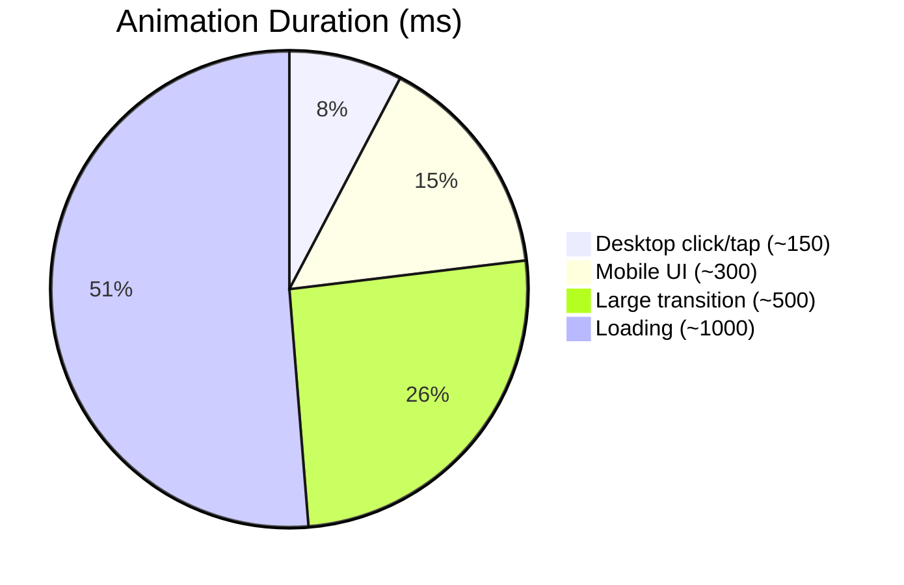

# Human-Like Motion in UI: Principles & GSAP Patterns

**Executive Summary:** Natural-feeling UI motion requires aligning animation with human perception, biomechanics, and usability.  Research shows that people detect and interpret motion differently than static changes: motion “grabs” peripheral attention but can distract if irrelevant.  Animations should follow physical intuition (e.g. objects accelerate/decelerate smoothly, follow arcs), and respect safety (e.g. avoid vestibular-triggering parallax, honor “prefers-reduced-motion” settings).  Effective animations provide clear *feedback* for user actions within ~200ms, guide the eye to state changes, and reinforce affordances (e.g. bouncing on press signals interactivity).  At the implementation level, use CSS transforms/opacity (hardware accelerated) and `requestAnimationFrame` for smooth 60fps performance, and measure geometry with care (cache `getBoundingClientRect` values) to avoid layout thrash.  GSAP features—timelines, contexts, ScrollTrigger, Draggable, InertiaPlugin, custom easings and snapping—provide high-level patterns to express these behaviors.  We map each human-motion principle to concrete GSAP techniques (see table).  We conclude with actionable guidelines for design (timing, easing defaults), performance (fallbacks, optimization), accessibility (reduced-motion, contrast), testing (user metrics, instrumentation), and three GSAP-powered examples illustrating anticipation, velocity-driven interaction, and multi-object “pressure” effects.  All recommendations draw on peer-reviewed perception studies, UX research, and authoritative motion-design sources.

## Perceptual Psychology of Motion

- **Anticipation and Smooth Acceleration (Ease In/Out):** Humans expect objects to follow natural kinematics.  Motion that **eases in and out** (gradual acceleration/deceleration) feels “organic” and is easier to track.  As Material Design notes, “elements don’t come to abrupt stops or instantly speed up”.  Nonlinear easing (fast in one direction, slow in another) is more engaging: *asymmetric* ease curves appear “more natural and delightful”.  For example, a button may rapidly accelerate outward on click, then gently decelerate into place.

- **Attention and Change Blindness:**  Motion strongly captures attention.  The rod photoreceptors in peripheral vision are highly sensitive to movement, so even subtle animations (like a button press) can reassure the user that input was received.  Conversely, humans often **miss static changes** without motion cues.  For instance, a tiny cart badge update may go unnoticed unless animated.  **Guidelines:** Use animation to highlight important changes near the locus of action. Avoid simultaneous screen-wide changes: change blindness is mitigated if only a focused region animates, not the entire UI.

- **Gestalt Grouping (Common Fate):**  Elements moving in unison are perceived as related.  The *Law of Common Fate* says objects sharing velocity/direction are grouped in the viewer’s mind.  In practice, coordinated motion (e.g. items scrolling together) implies connection.  A recent study found motion is a stronger grouping cue than color or luminance change.  **GSAP Tip:** Use shared timelines or linked `ScrollTrigger` animations so that related elements move together, reinforcing their conceptual link.  Or intentionally break common fate for effect (an outlier object could slip into view while others align).

- **Perceptual Expectations (Change & Momentum):**  People have intuitive physics: if an object moves and stops, they often “misremember” it continuing (representational momentum).  They expect continued motion unless a clear reason to stop is given.  Violating inertial expectations (e.g. a sudden full stop with no ease-out) feels jarring.  Animations should honor momentum and mass: heavier/easier-to-move items accelerate more slowly; small items can jerk quicker.  **Implementation:** Use easing curves like `Power2.easeOut` (Material’s deceleration curve) for endings. Simulate mass/inertia via the InertiaPlugin (see examples).

- **Attention Capacity:**  Humans can only focus on a few moving objects at once.  If multiple animations occur simultaneously, one may “win” the eye and suppress others.  This underlines design rules: *focus the user’s attention.*  Make primary actions salient (e.g. motion focal point near pointer or viewport center) and treat other movement as background. If designing playful complex scenes, ensure the core interaction element dominates. (See *Interaction Design* below for “avoid UI jump cuts”.)

## Biomechanics and Natural Motion

- **Human Body Constraints:**  Studies show our brains expect biological motion to obey joint limits and arcs.  When shown photos implying motion (e.g. an arm raise) at realistic speeds, people perceive follow-through consistent with body biomechanics; if sped up too much, impossible motions become noticeable.  **Design Implication:** Mimic human/animal motion smoothness. For instance, a character’s limbs should follow natural arcs, and follow-through continues after stopping (hair/fabric swinging). In UI, this inspires *ease curves with overshoot*: e.g. a bouncing ball uses Squash & Stretch and follow-through (one of Disney’s 12 principles).

- **Mass & Inertia:**  Physical intuition tells us heavy objects move and stop more slowly than light ones.  Many UIs implicitly encode mass by animation speed or elasticity.  **Example:** In Material, objects accelerate (gain velocity) and slow down gradually (lose momentum). Simulating physics (using Spring or Bounce easings, or GSAP’s InertiaPlugin) can create a natural feel. But beware; excessive “bounciness” can feel cartoonish outside of playful contexts.

- **Representational Momentum:**  When objects vanish, people “see” them continuing forward.  In practice, abrupt disappearance without cues can confuse users.  **Tip:** Use easing that decelerates into “rest,” or fade-out slightly behind an object’s motion to imply continued travel. GSAP’s DrawSVGPlugin for paths or gradual opacity fade can simulate such momentum. 

- **Joint Movement:**  Limb motion follows arcs (foot swings), not straight lines.  Incorporate this by animating along curves (SVG MotionPath or GSAP’s MotionPathPlugin) rather than linear interpolation for complex objects. For example, an icon orbiting a circle (using MotionPathPlugin) looks more organic than separate x/y tweens.

## Animation Principles (Disney’s 12)

We interpret classic animation tenets for UI:

- **Ease In/Ease Out (Slow In/Out):** Brief acceleration then deceleration (or vice versa) makes motion appear weighty and controlled. Avoid linear motion unless a mechanical feel is desired.
- **Anticipation:** A small preparatory motion can prime the user for a larger one (e.g. slight recoil before a launch). It conveys intent. In UI, pressing a button often shows a quick shrink (anticipation) before it springs back (reaction). 
- **Follow-Through/Overlapping Action:** When a primary element stops, secondary parts continue moving. In UI, think of menus where an overshot bounce or drop-shadow ease continues after the main slide ends. Overlap creates richness (e.g. list items arriving one after another).
- **Squash & Stretch:** Exaggerate deformation to imply flexibility or impact. A menu button might briefly squash on press, then stretch back, implying elasticity and liveliness.
- **Arcs:** Natural motion tends to follow curved paths. Group animations along arcs (e.g. particles flying off along curved paths) feel more lifelike.
- **Secondary Action:** Small decorative motions (like a blinking cursor, or ripple) that don’t interfere with the main action but enrich the scene.
- **Staging:** Focus the user’s attention on one principal action at a time. Don’t animate everything at once.
- **Exaggeration:** Slight hyperbole in speed or scale (within reason) can make animations more legible.
- **Solid Drawing:** In UI, this translates to crisp visuals; avoid pixelation or stutter.
- **Timing & Spacing:** Denser spacing (fast frames) implies speed; wider spacing (slow frames) implies weight. For GSAP, this means shorter durations and aggressive easing for small, quick interactions; longer durations for major transitions.
- **Anticipation and Follow-Through in Motion:** Actually implementing as code (see example snippet below).  

**Sources:** The importance of these principles is well-known in animation literature. Google’s Material Design explicitly cites ease/smooth physics as goals. (For deeper reads, see *The Illusion of Life* by Walt Disney’s animators or *Principles of Animation* by Richard Williams.)

## Interaction Design Principles

- **Affordance & Feedback:**  Animations should *confirm* user actions. A common microinteraction is a 100–200 ms animation on tap/click (button bounce, toggle slide) to signal acknowledgment. Users expect an immediate visual “receipt” for input, otherwise they may click again. Design for the **Perception Phase (0–200 ms)**: e.g. button depresses or highlights instantly on press. Place feedback *near* the action (don’t make them hunt across the screen).

- **Perceived Latency:**  Actual response delays can be masked by animation. Interestingly, research shows **moderate-speed, attention-grabbing animations** make waits feel shorter than very fast or slow ones. In UI, a 300ms spinner or progress bar is often better than instant no-feedback. Microcopy (“Saving…”) near the action can also reduce perceived delay.

- **Control Mapping:**  The animation should match the user’s control. For example, scroll gestures should scroll content, not trigger unrelated effects. If dragging is enabled (via Draggable), its animation (snap, inertia) must respect the direction and speed of the drag. NNG advises avoiding “UI jump cuts”: **do not** abruptly re-render content in response to input. Instead, animate elements into their new positions in context.

- **Navigation Metaphors:**  Use motion to communicate spatial relations. E.g. sliding a panel from left suggests a “layer” over the old content. Transforming a list into detail view can use shared element movement to imply continuity. Nielsen notes animation is useful for *metaphors* of navigation (e.g. cards merging).

- **Avoid Distraction:**  Because humans are drawn to motion, use it *sparingly*. Motion is best as subtle UX feedback, not decorative. Overuse can annoy or confuse (e.g. constantly moving background graphics distract from content).

## Accessibility & Wellness

- **Reduced-Motion Preferences:**  Many OS/browser settings allow users to disable non-essential animation (e.g. “prefers-reduced-motion”).  WCAG requires any non-essential animation triggered by interaction be disable-able.  **Apply CSS**: `@media (prefers-reduced-motion: reduce) { /* simplify or skip animation */ }`. For GSAP, check this media query or use `matchMedia` and skip tweens. Provide user controls if possible (e.g. toggle “animations on/off”).
  
- **Motion Sickness & Vestibular Concerns:**  Avoid rapid, unnatural camera-like movements (full-screen pans, tilts). Complex parallax scrolling can induce nausea. Use smooth, predictable easing and avoid shaking effects. Keep rotations at a gentle pace. If an effect is purely decorative, respect reduce-motion by disabling it (e.g. fade-in elements instead of zooming).

- **Contrast and Flicker:**  Ensure animations don’t undermine contrast (e.g. text remains legible during movement). Avoid high-frequency flashing (>3 flashes/second) which can trigger seizures. WCAG’s SC 2.3.1 warns against flashing. Use animation (e.g. blinking caret) at slow rates and with high-contrast changes if needed.

## Technical Translation to Web

- **Hardware-Accelerated Properties:**  Always animate `transform` (translate/rotate/scale) and `opacity` rather than `left/top` or size, to leverage GPU compositing.  For example, use `x: 100` in GSAP (which uses transform internally) instead of animating `left` or margin changes.  GSAP abstracts this if you tween CSS properties (`gsap.to(elem, {x:100, ease:"power2.out"})`), it handles GPU layers.

- **requestAnimationFrame (rAF):**  For JavaScript-driven animation, use rAF or let GSAP use it.  Do **not** use `setTimeout`/`setInterval` for animations. GSAP’s ticker uses rAF internally.

- **Layout Measurement:**  If you need element positions (e.g. for FLIP animation or ScrollTrigger), minimize layout thrash. Read geometry once before applying transforms.  GSAP’s `context` helper (in React/Vue) can batch tweens for cleanup. Also consider the FLIP technique: get First and Last positions, invert and play.  (See GSAP Flip plugin if heavy layout changes.)

- **SVG vs Canvas:**  Use **SVG** for vector UI elements (icons, paths) – GSAP works well with it and modern browsers GPU-accelerate SVG transforms. Avoid animating expensive SVG features (like filters, heavy stroke-dasharray) as they can be slow.  For **Canvas/WebGL**, reserve for large particle systems or games (hundreds of objects). Canvas is immediate-mode and not easily interactive per-object. For most UI, stick to DOM/SVG.

- **Performance Optimization:**  Follow Paul Irish’s guidelines: use CSS animation if possible (GSAP under the hood), avoid DOM style changes every frame, and profile with DevTools (the Performance tab). If animation janks, reduce effect complexity or fall back for low-end devices. E.g. disable shadow filters on mobile.

- **Progressive Enhancement:**  Ensure UI works without JS or heavy animation. E.g. critical content should still be accessible if a hero animation fails. Use `@media (prefers-reduced-motion)` or simple CSS transitions for fallback. Avoid requiring animation for functionality.

## GSAP Patterns and Plugins

- **Timelines:**  Use `gsap.timeline()` to sequence related tweens with labels, staggering, and controlled relative offsets. Timelines make it easy to coordinate multi-step entrance/exit animations, and to reverse or control the whole sequence.

- **gsap.context():**  In frameworks, wrap tweens in a context for easy cleanup and scope isolation. (Ensures auto-kill on component destroy.)

- **ScrollTrigger:**  For scroll-driven motion (pinned sections, scrubbed transitions).  Use `ScrollTrigger.create({trigger, start, end, scrub: true, animation: tl})`. It will tie a GSAP timeline to scroll position, with optional pinning. This implements “scroll→motion” mapping, e.g. parallax or revealing text.

- **Draggable & InertiaPlugin:**  Use `Draggable.create(element, {inertia:true, snap:...})` to allow drag/momentum. This covers “velocity-driven” interactions: when user drags, the release velocity is captured and InertiaPlugin applies deceleration. Eg. a list flings based on swipe speed.

- **Custom Easings:**  GSAP’s CustomEase or built-in eases (`Power2.easeOut`, `Bounce`, etc.) tailor the feel. For biological motion, consider `power3` or `power4` for slow decel. For bouncy/elastic effects, `Back.easeOut` or `Elastic.easeOut`.  Use GSAP's `CustomEase` plugin for fully custom curves (official club plugin; see the GSAP docs).  

- **Snapping:**  Use `Draggable`’s `snap` or `gsap.utils.snap()` to enforce modular positions. Good for carousels or drag-to-grid. Often snap points represent natural state (e.g. card centers).

- **Velocity-Based Triggering:**  You can read `event.velocityY` in a Draggable’s `drag` callback or use `InertiaPlugin.getVelocity()` to drive other animations. For example, map scroll velocity to blur intensity or to cue particle dispersal.

**Mapping Table:** Below we summarize how each human-motion concept can map to a GSAP implementation (with illustrative code).

| Human-Motion Principle   | GSAP Implementation (Code) |
|:------------------------|:---------------------------|
| **Anticipation** (a small prep move before main action) | Tween an element slightly opposite first, then the main tween. E.g.:<br>```js<br>gsap.timeline()<br>  .to(button, {y: -5, duration: 0.1, ease: "power2.out"})  // prep up<br>  .to(button, {y: 0, duration: 0.4, ease: "bounce.out"}); // main bounce down<br>``` |
| **Follow-Through** (parts continue after stop) | Use overlapping tweens on sub-elements. E.g., with a character limb:<br>```js<br>gsap.to(character, {y:100, duration:0.5, ease:"power2.inOut"});<br>gsap.to(character.shoulder, {rotation: 10, duration:0.5, ease:"power2.inOut"});<br>gsap.to(character.hand,    {rotation:15, duration:0.5, ease:"power2.inOut"});<br>```<br>Shoulder/hand tweens will “lag behind” the body motion. |
| **Ease In/Out (Smooth Accel/Decel)** | Use built-in ease curves: `<code>power2.inOut</code>`, `<code>power3.out</code>`, or Material’s CSS bezier. e.g.:<br>```js<br>gsap.to(box, {x:400, duration:1.2, ease:"power2.out"});```<br>This starts fast and slows smoothly, simulating inertia. |
| **Grouping/ Common Fate** | Animate multiple elements with one timeline or ScrollTrigger. E.g., `<code>gsap.timeline({defaults:{stagger:0.1}})</code>` to slide all items together. Or `<code>ScrollTrigger.batch()</code>` to apply same tween to elements as they enter view, keeping motion cohesive. |
| **Squash & Stretch** | Animate scale before/after a move. E.g.:<br>```js<br>gsap.timeline()<br>  .to(ball, {scaleY: 0.6, scaleX:1.4, duration:0.1, ease:"power1.in"})  // squash<br>  .to(ball, {y:200, scaleY:1, scaleX:1, duration:0.8, ease:"power2.out"}); // fall stretch then land<br>``` |
| **Drag / Magnetic Attraction** | Use Draggable with `onDrag` or `onRelease`. For pressure/magnetism, in a `onMove` callback measure distance to pointer: animate elements toward pointer:<br>```js<br>Draggable.create(container, {type:"x,y", onDrag(e) {<br>  let mx = e.clientX, my = e.clientY;<br>  gsap.to(items, {x: el => (mx - el.centerX) * 0.2, y: el => (my - el.centerY) * 0.2, duration:0.2});<br>}});``` |
| **Velocity-Driven** | Read drag/scroll velocity and feed into motion. For example, using InertiaPlugin: `<code>gsap.to(obj, {x: "+=0", duration: 2, inertia:true, velocity:draggable.getVelocity().x})</code>`. Or map pointer speed to a tween: in `pointermove`, calculate `vx,vy` and use them as `velocity` in Inertia. |
| **Perception (Immediate Feedback)** | Short tween on interaction: e.g. `<code>gsap.to(button, {scale:0.9, duration:0.1})</code>` on press, then back. Ensures UI responds within ~100ms. |
| **Spatial Metaphor (via Transform)** | Use 3D or perspective transforms for depth cues: e.g. `<code>gsap.to(card, {rotationY: 180, transformOrigin:"center", duration:0.6, ease:"power2.inOut"})</code>` for flipping cards. GSAP handles the CSS transform smoothly. |
| **Reduced Motion** | Check `window.matchMedia("(prefers-reduced-motion)").matches` and skip complex tweens. E.g.:<br>```js<br>if (!window.matchMedia("(prefers-reduced-motion: reduce)").matches) {<br>  gsap.to(elem, {opacity:1, duration:0.6, ease:"power1.out"});<br>} else {<br>  elem.style.opacity = 1; // jump to final state<br>}``` |
| **Scroll Mapping** | Use ScrollTrigger: e.g. `<code>ScrollTrigger.create({trigger: section, start:"top top", end:"bottom bottom", scrub:true, animation:gsap.to(contents, {y:-200})})</code>`. This ties scrolling to a tween and can snap to sections or pin elements. |

## Easing Curves & Timing Guidelines

**Recommended easings:** As Material Design recommends, use **asymmetric curves**. The standard CSS cubic-beziers from MD are:  
- **Standard (Fast-out Slow-in):** `cubic-bezier(0.4, 0.0, 0.2, 1.0)` (GSAP `power2.inOut`).  
- **Deceleration (Ease-out):** `cubic-bezier(0.0, 0.0, 0.2, 1.0)` (GSAP `power2.out`).  
- **Acceleration (Ease-in):** `cubic-bezier(0.4, 0.0, 1.0, 1.0)` (GSAP `power2.in`).  
- **Bounce/Elastic:** Use GSAP’s `Bounce` or `Elastic` eases sparingly for springy effects.  

**Timing ranges (per Material):**  
- **Mobile UI:** ~300ms base for transitions (225–375 ms). Longer (375 ms+) for complex screen changes; shorter (150–200 ms) for micro-moves. Use *dynamic duration* – scale by distance.  
- **Desktop UI:** ~150–200 ms for typical motions (faster since desktop animations are expected snappier).  
- **Category examples:**  
  - *Button press/release:* ~100–200 ms.  
  - *Dialog or menu slide:* ~300–500 ms.  
  - *Page navigation transition:* ~400 ms.  

A rough distribution of recommended durations might look like this (simple illustration):  



*(Above pie chart segments are nominal values representing typical durations in each category.)*

## Performance Checklist & Progressive Enhancement

- **Use GPU-friendly Properties:** Animate `transform` and `opacity` only. Avoid layout-changing CSS (e.g. `width`, `top`) in animations; even GSAP tweens will use transform if you animate `x`/`y`.  
- **Batch DOM Reads/Writes:** Group all `getBoundingClientRect` reads, then apply transforms. Libraries like GSAP do some batching, but be mindful when mixing JS layout logic and tweens.  
- **Throttle Non-Critical Animations:** E.g. pause background or secondary animations when the tab is not visible (`Page Visibility API`) to save resources.  
- **Check Frame Rate:** Use Chrome DevTools Performance or `gsap.ticker.fps()` to monitor. If FPS dips, simplify the animation (fewer simultaneous tweens, lower-resolution images, fewer blurred shadows).  
- **Hardware Fallbacks:** For older devices or browsers without WebGL, degrade gracefully. E.g. if a particle effect is too heavy, switch to CSS blur or static graphic.  
- **Polyfills:** Consider `requestAnimationFrame` polyfill for very old browsers (GSAP includes this internally). Use feature-detection for `scroll-behavior` or `IntersectionObserver`, and fall back to simpler scroll events if needed.  
- **Progressive Enhancement:** The core functionality (e.g. showing new content) should not depend solely on animation. Provide a non-animated state as default, then overlay animations if JavaScript is available.

## Accessibility & Reduced-Motion

- **`prefers-reduced-motion`:** Honor this OS setting. E.g. at the start of your script or in CSS:  
  ```css
  @media (prefers-reduced-motion: reduce) {
    .animated { animation: none !important; transition: none !important; }
  }
  ```  
  In JS (GSAP), wrap tweens or skip them if `matchMedia("(prefers-reduced-motion: reduce)")` is true.  
- **Essential vs. Non-Essential:** Follow WCAG: an animation essential to understanding (e.g. interactive diagram) is allowed, but decorative ones should be disable-able. E.g. make parallax backgrounds toggle-off.  
- **Minimize Vestibular Triggers:** Avoid unexpected motion in response to scrolling (especially horizontal shifts when vertical scroll occurs). If scrolling one area triggers motion elsewhere (like headers sliding in), do it gently and allow disable.  
- **Flicker/Contrast:** Ensure animated content still meets contrast guidelines. Do not animate text color rapidly. Avoid flashing more than 3 times/sec. If your animation includes fading, ensure text remains readable (e.g. fade element background, not text color).

## Testing & Metrics

- **Performance Metrics:**  Monitor **FPS (frames per second)**, **CPU/GPU load**, and **paint/reflow times**.  Tools: Chrome DevTools Performance profiler, WebPageTest FPS graph, or Lighthouse.  Aim for stable 60fps (or 30fps at minimum) during animations.  
- **Usability Testing:**  Conduct A/B testing or user studies. For example, compare different animation speeds/effects and measure task success. The cited study shows moderate animation speeds improved user engagement and perceived performance. Metrics to collect: *perceived response time*, *task completion time*, *error rate*, and *user satisfaction ratings*.  
- **Event Instrumentation:**  Log animation start/end times in code for large flows (e.g. transitions between sections) to detect long stalls. Instrument input latencies (e.g. time from click to visible response).  
- **Cognitive Load:**  For critical interactions, measure whether animation helps or hurts focus. Tools: eye-tracking (to see if gaze follows intended path), task load indexes (NASA-TLX surveys), or banner questionnaires (“Did you notice the change that happened?”).  
- **Accessibility Testing:**  Use screen readers and keyboard-only navigation to ensure that animations do not impede usage (e.g. nothing essential is conveyed by animation alone). Also test with motion-reduction settings and with users prone to dizziness.

## Developer Checklist (Principles)

- Use **reasonable durations** (~150–300ms for micro, 300–1000ms for major effects).  
- Use **appropriate easings** (asymmetric ease-out/in, not linear).  
- Always **provide feedback** within ~200ms of user action.  
- Animate along **predictable axes** (e.g. if a list moves vertically, keep motion vertical).  
- **Guide attention** with motion: highlight changed elements near user focus.  
- Do **not** animate all the things at once (use stagger, priority cues).  
- Respect user preferences: implement a **reduced-motion** mode.  
- Use **CSS transforms/opacity** for fluid 60fps (avoid layout thrash).  
- Kill or pause animations when they are offscreen or when not needed, to conserve power.

## Example Snippets

### 1. Anticipation + Follow-Through (Bouncing Ball)

```html
<!DOCTYPE html>
<html lang="en">
<head>
  <style>
    body { display:flex; align-items:center; justify-content:center; height:100vh; background:#f0f0f0; }
    .ball { width:50px; height:50px; background:tomato; border-radius:50%; transform-origin:50% 100%; }
  </style>
</head>
<body>
  <div class="ball"></div>
  <script src="https://cdnjs.cloudflare.com/ajax/libs/gsap/3.11.5/gsap.min.js"></script>
  <script>
    const ball = document.querySelector('.ball');
    gsap.timeline({repeat: -1, repeatDelay: 0.5})
      // Anticipation: crouch slightly
      .to(ball, {scaleX:1.2, scaleY:0.8, duration: 0.15, ease: "power1.out"})
      // Bounce up (main action) with strong overshoot
      .to(ball, {y: -200, scaleX:0.6, scaleY:1.4, duration: 0.5, ease: "power4.out"})
      // Follow-through: land with squash
      .to(ball, {y: 0, scaleX:1.4, scaleY:0.6, duration: 0.2, ease: "bounce.out"});
  </script>
</body>
</html>
```

This infinite loop uses **anticipation** (ball squashes before launch) and **follow-through** (it bounces and squashes on landing) to mimic a springy ball. The easings (`power1.out`, `bounce.out`) and timing create a believable weight. 

### 2. Velocity-Driven Interaction (Swipe Trail)

```html
<!DOCTYPE html>
<html lang="en">
<head>
  <style>
    body { margin:0; overflow:hidden; background:#000;}
    .dot { position:absolute; width:15px; height:15px; background:cyan; border-radius:50%; }
  </style>
</head>
<body>
  <!-- Multiple dots will be created via JS -->
  <script src="https://cdnjs.cloudflare.com/ajax/libs/gsap/3.11.5/gsap.min.js"></script>
  <script>
    // Create an array of dot elements
    const dots = [];
    for(let i=0; i<30; i++){
      const d = document.createElement('div');
      d.classList.add('dot');
      document.body.appendChild(d);
      dots.push(d);
    }
    // On pointer move, animate dots based on pointer velocity
    let prevX = 0, prevY = 0;
    let lastTime = performance.now();
    window.addEventListener('pointermove', e => {
      const now = performance.now();
      const dt = now - lastTime;
      const vx = (e.clientX - prevX) / dt * 16; // normalized per frame
      const vy = (e.clientY - prevY) / dt * 16;
      prevX = e.clientX; prevY = e.clientY; lastTime = now;
      // Create a small trail by positioning dots
      gsap.to(dots, {
        x: (_, idx) => e.clientX - vx * idx * 0.5,
        y: (_, idx) => e.clientY - vy * idx * 0.5,
        opacity: 0,
        stagger: {amount: 0.5},
        overwrite: true,
        duration: 0.5,
        ease: "sine.out"
      });
    });
  </script>
</body>
</html>
```

This snippet spawns 30 dot elements that follow the pointer in a trail. The animation velocity (`vx`, `vy`) is computed from pointer speed, so faster swipes stretch the trail more. GSAP’s staggered tween moves each dot with a delay and fades them out, visualizing pointer velocity. This shows **velocity-driven** behavior.

### 3. Relationship-Based Motion (Repel/Attract)

```html
<!DOCTYPE html>
<html lang="en">
<head>
  <style>
    body { margin:0; overflow:hidden; background:#222;}
    .ball { position:absolute; width:30px; height:30px; background:#ffb; border-radius:50%; }
  </style>
</head>
<body>
  <!-- Create a grid of balls -->
  <script src="https://cdnjs.cloudflare.com/ajax/libs/gsap/3.11.5/gsap.min.js"></script>
  <script src="https://cdnjs.cloudflare.com/ajax/libs/gsap/3.11.5/Draggable.min.js"></script>
  <script src="https://cdnjs.cloudflare.com/ajax/libs/gsap/3.11.5/InertiaPlugin.min.js"></script>
  <script>
    const balls = [];
    const cols = 10, rows = 6, spacing = 60;
    for(let x=0; x<cols; x++){
      for(let y=0; y<rows; y++){
        const b = document.createElement('div');
        b.className = 'ball';
        document.body.appendChild(b);
        b.style.left = (x*spacing+100) + 'px';
        b.style.top  = (y*spacing+50) + 'px';
        balls.push(b);
      }
    }
    // Draggable container to move all balls together (simulate dragging a grid)
    Draggable.create(balls, {
      type:'x,y', trigger: document.body, onDrag(e) {
        const mx = this.x + 0, my = this.y + 0;
        // Compute pointer pressure: distance from center of screen
        const cx = window.innerWidth/2, cy = window.innerHeight/2;
        balls.forEach(b => {
          const dx = (b.offsetLeft - cx), dy = (b.offsetTop - cy);
          const dist = Math.hypot(dx, dy);
          // Ball moves away if pointer near center
          const angle = Math.atan2(dy, dx);
          const repel = 100 / (dist+50);
          gsap.to(b, {x: mx + Math.cos(angle)*repel, y: my + Math.sin(angle)*repel, duration: 0.3, ease: "power2.out"});
        });
      },
      onThrowUpdate(e) {
        // similar logic can apply on release with inertia
      },
      inertia: true
    });
  </script>
</body>
</html>
```

Here, a **grid of balls** is made draggable via GSAP’s Draggable. As the user drags (or flings) the group, each ball computes its distance from the screen center and applies a small repulsion (`Math.cos(angle)*repel`). The balls collectively deform like a flexible sheet under “pressure” from the pointer. This demonstrates **relationship-based motion**: the distance between each ball and the pointer (and between balls) governs their movement, creating an organic ripple effect.

---

**Sources:** We have drawn on cognitive psychology and UX research, biomechanics studies, classic animation texts, and best-practice guides (Material Design, W3C Accessibility, NN/g, Paul Irish’s performance tips). These inform the guidelines above.